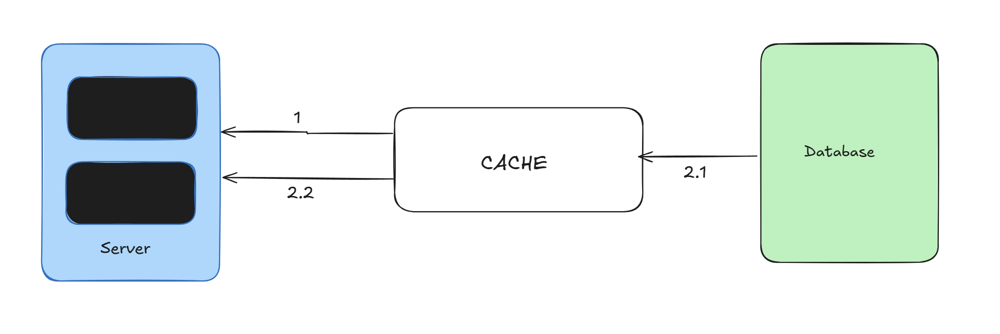
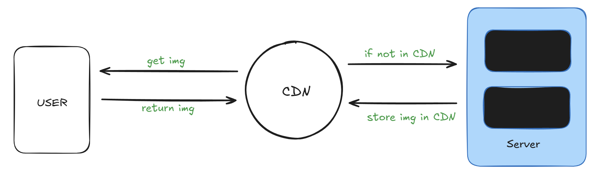

# System Design - I

- [Server Setups](#server-setups)   
- [Types of Databases](#types-of-databases)
- [Web Server Scaling](#web-server-scaling)
- [Load Balancer](#load-balancer)
- [Database Replication](#database-replication)
- [Caching](#caching)
- [CDN](#cdn)
- [Web Architectures - State & Stateless](#web-architecture---state--stateless)
- [Data Center & geoDNS](#data-center--geodns)
- [Message Queue](#message-queue)
- [Logging, metrics and automation](#logging-metrics-and-automation)
- [Database Scaling](#database-scaling) 

# Server Setups  
- __Single Server Setup:__
 
- __Multiple Server Setup:__

# Types of Databases   
- __Relational Database__
- __Non-Relational Database__
# Web Server Scaling  
- __Vertical Scaling__
- __Horizontal Scaling__    

# Load Balancer

# Database Replication

# Caching

# CDN

# Web Architecture - State & Stateless
# Data Center & geoDNS
# Message Queue
# Logging, Metrics and Automation
# Database Scaling